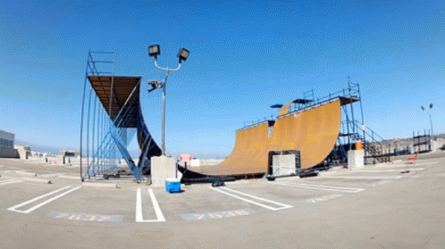
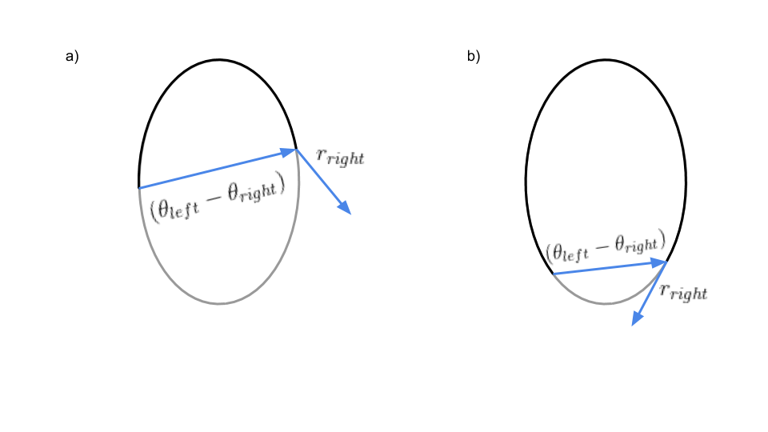
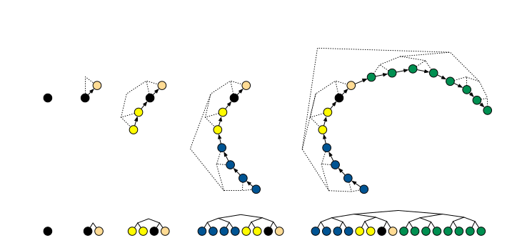

```{r setup, include=FALSE}
knitr::opts_chunk$set(echo = TRUE)
devtools::load_all()
```


# <bdi style="color:white;">Metropolis(-Hastings)</bdi>r {data-background="algorithm.jpg"}

## random walk

* proposal in MH is sampled randomly from porpoals/jumping distrib $J_t(\theta_a|\theta_b)$
* the accpetance rule/ transition function ratio of densities guarantees convergence

$$
\begin{aligned}
T_t(\theta^t|\theta^{t-1}) = \frac{\frac{p(\theta^*|y)}{J(\theta^*|\theta^{t-1})}}{\frac{p(\theta^{t-1}|y)}{J(\theta^{t-1}|\theta^*)}}
\end{aligned}
$$

* *But* if steps are poorly chosen converges speed, and accordingly, computational effort can get high

## Relation between jumping rule and convergence

$J(\cdot)$ is only useful jumping distibution, if:

* For any $\theta$ it is easy to sample from $J(\theta_a|\theta_b)$
* It is easy to compute r (e.g. if proposal is symmetric)
* The jump has a *reasonable* distance
* We don't reject/ accept jumps to often

(see @gelman13)

But how can we know that

## Problem

```{r, echo=FALSE, out.width='75%'}
knitr::include_graphics("files/HMC_multimodal.gif")
```

@feng20

* Gibbs and MH spend a lot of time zigging and zagging in the target distribution
* For models in High-D parameter-space reparametrization  and efficient jumping rules might fail

## Idea

* Introduce a momentum $\phi_j$ for each component $\theta_j$
* update $\theta\ \& \ \phi$ simultaneously
* Let the jumping distribution $J(\cdot)$ be largely determined by $\phi$

$\rightarrow$ the resulting algorithm is somewhat a *hybrid* Monte Carlo with a
mix of the known random walk and deterministic simulation methods derived from hamiltonian dynamics

# Hamiltonian Monte Carlo

## HMC in 3 steps:

1) update $\phi$, dawn from posterior $p(\phi)$
2) simultaneously updating of $(\theta,\phi)$ via leapfrog steps
3) acceptance/ rejection step analog to MH-Algorithm

## Ingredients

* (un-normalized) posterior density $p(\theta|y)$
* gradient of $log_e(p(\theta|y))$

$$
\frac{\partial log_e(p(\theta|y))}{\partial \theta}
$$
(Note: use analytic solutions here if possible, numerical might make the computational benefit vanish)

* the momentum distribution $p(\phi)$  
$\rightarrow$ usually $\phi \sim \mathcal{N_d}(0, I)$ where 0 denotes a zero vector of $\mathbb{R^d}$ and I denotes a $\mathbb{R^{dxd}}$ identity matrix

## Intuition of Leapfrogsteps

* Think of 1/2/3D density curvature
* preserving the posterior for $\lim_{e \to 0} p(\theta,\phi|y)$
* Suppose HMC moves towards *low posterior density regions*:


$$
sgn\Big(\frac{dlog_e(p(\theta|y))}{d\theta}\Big) = -1 \ \Rightarrow \ \phi\ decreases
$$

* Suppose HMC moves towards *a local posterior maximum*:

$$
\frac{dlog_e(p(\theta|y))}{d\theta} = 0 \ \Rightarrow \ p(\theta|y)\ slows \ by\ moving\ closer\ to\ local\ max
$$

$\rightarrow$ HMC works like a mode-finder

## Phylical analogy

```{r, echo=FALSE, out.width='75%'}

```

## Code


```{r, warning=FALSE, code=readLines("../R/Hamiltonian_MonteCarlo.R")}
```


## Problem

```{r, echo=FALSE, out.width='75%'}
knitr::include_graphics("files/HMC_problem.gif")
```

@feng20

* taking too few or too large steps $\rightarrow \ \theta^t\ \& \ \theta^{t+1}$ end up very close. 

## Setting the tuning parameters I

(Hand-)Tuning Parameters:

$\epsilon = stepsize$  
$\mathcal{L} = \#Leapfrogsteps$  
$\phi = momentum$  

There are several heuristics and strategies to set the tuning parameters:

## Setting the tuning parameters II

* *Radius*:
  
  stay in the radius of you target distribution. Rule of thumb: $\epsilon \mathcal{L} = 1$

* *adaptive updating*: 

  1) run $M_{init}$ steps with initial setting

  2) adjust the parameters based on knowledge from previous run and rerun the model for $M_{adjust}$ steps
  
* *Acceptance Sweet Spot*: 65% acceptance rate ($\alpha$)
  
  if $\alpha < 0.65 \Rightarrow$ leapfrog jumps are too ambitious.
  Set $\mathcal{L}\uparrow, \epsilon \downarrow$.
  
  if $\alpha > 0.65 \Rightarrow$ leapfrog jumps are too cautious.
  Set $\mathcal{L}  \downarrow, \epsilon \uparrow$.
(see @gelman13)


## Desirable behavoir for tuning parameters tuning parameters HMC:

1) $\mathcal{L}$ driving the trajectory of steps in one iteration though the whole posterior space.
*Tackeled by NUTS*

2) $\epsilon$ getting smaller in areas of high curvature exploiting various areas.
*Tackeled by dual averaging*

3) $Covar(\phi)$ scaling to the local curvature.
*Riemanian Integral*

\rightarrow All three approaches may be combined. In the following we will discuss the implementation for a No-U-Turn sampler with dual averaging, as discussed in Gelman and Hoffman (2014).@hoffman2014

# The (naive) No-U-Turn Sampler

## Problem of adapting $\mathcal{L}$ and $\epsilon$ within the run

* As we use the information from Hamiltonian dynamics to tune $\epsilon$ and $\mathcal{L}$ within the run iteration don't guarantee convergence anymore

* Property of markov chain is not given anymore

* What do we do now?

  + Derive a heuristic when we want to stop the sampling
  + Ensure the adaption satisfies the Markov Chain properties

## Heuristic: Excurs on Trajectories

* Lets look at one iteration $t$ in HMC where we intentionally set
  a) $\mathcal{L_t}$ to small
  b) $\mathcal{L_t}$ to high

* The $\mathcal{L_t}$-Leapfrog steps performed from starting state $q_{right} = (\theta_{right}, r_{right})$ in phase-space to theit end after  might look as follows $\mathcal{L_t}$ Leapfrogsteps $q_{left} = (\theta_{left}, r_{left})$ 

## Heuristic Stopping Criteria

```{r, echo=FALSE}
lable1 <- "a) expanding the trajectory in either direction typically extends the trajectory further  across the energy level set (grey) towards unexplored neighborhood\n
b) further expansion typically contracts the boundaries of the trajectory towards each other and neighborhoods that have already beenexplored\n"
```


```{r, echo=FALSE, fig.cap=lable1, out.width="75%"}

```

\rightarrow explore the energy level stepwise @betancourt2017

## Criterion

$$
r_{left} (\theta_{right} - \theta_{left}) < 0\\
r_{right} (\theta_{left} - \theta_{right}) < 0
$$
*Derivation:* this is basicly a euclidean derivative w.r.t. time t of half the squared distance between two positions: $\frac{d(\theta_1 - \theta_2)}{dt}$.
*Intuition:* this is the dot product of the two vectors fromthe picture.
If the dot product gets higher than 0, the trajectory wil make a *u-turn*.
This is when we "travelled maximally" in phase space an so where we want to stop exploring the enery set.

## Naive Stepwise Exploration Scheme

1) Build a trajectory with a given length
2) Check the Termination (No-U-Turn) Criterion
3) Expand the trajectory and & Repeat Checks
4) Return the sample once the criterion is met

## Doubling- expand the trajectory

Naive Additive Scheme: Check the termination Criteria for each and every point between any two points
Smart Multiplicative Scheme: Double the trajectory to the old trajectory and so create a balanced binary tree. Compare the criterion only between subtrees.

```{r, echo=FALSE}
lable2 <- "typical doubling proccedure. initial point is black. Each colour desricbes a new subtree."
```

```{r, echo=FALSE, fig.cap=lable2, out.width="75%"}

```

@hoffman2014
The doubling is halted when the sub-trajectories from the leftmost to the rightmost nodes of any balanced binary tree start to double back on themselves.

*Info:* We have to double fore- and backwards in our trajectory to guarantee reversibility in time
*Problem*: this naive scheme still violates the reversibility criteria

## Slice to the Rescue

Some of the trajectory points sampled have to be condemn because they exhibit pathological behavior.
To determine those points we introduce a slice variable $u$ to our posterior, such that
$p(u|\theta,r) = Unif(u; [0, e^{\mathcal{L}(\theta) - \frac{1}{2} <r,r>}])$, where $p(\theta, r) \propto \mathcal{L}(\theta) - \frac{1}{2} <r,r>$ is the log-joint distribution of $\theta$ an $r$.

$p(u, \theta,r) \propto \mathbb{I}[u \in [0, e^{p(\theta, r)}]]$

*Alternative:* draw multinomial over states in the trajectory 

## Valid States

* Say $\mathcal{B}$ is the set of all sampled states
* $\mathcal{C} \supseteq \mathcal{B}$ is the set of all valid samples, if the following conditions hold:

1) $p(\theta,r| (\theta, r)\in \mathcal{C}) \propto p(\theta,r)$
ensures, if we restrict our attention to $\mathcal{C}$ the unnormalized density of an element $(\theta,r)$ from this set preserves the volume of our joint density $p(\theta, r)$
2) $p((\theta,r) \in \mathcal{C}| \theta, r ,u, \epsilon) = 1$
The current state must be included in $\mathcal{C}$
3) $p(u \leq e^{\mathcal{L}(\theta) - \frac{1}{2} <r,r>}|(\hat{\theta}, \hat{r}) \in \mathcal{C}) = 1$
any state in $\mathcal{C}$ defined is in the slice defined by $u$
4) Let $(\hat{\theta}, \hat{r}) \in \mathcal{C} ;(\theta, r) \in \mathcal{C} \Rightarrow For\ any\ \mathcal{B}\ p(\mathcal{B},\mathcal{C}| \theta, r, u, \epsilon) = p(\mathcal{B},\mathcal{C}| \hat{\theta}, \hat{r}, u, \epsilon)$
$\mathcal{B}\ \&\ \mathcal{C}$ must have equal probability of being selected no matter the current state

## Gibbs sample

Given the Conditions the following Gibbs sampling process leaves the joint distribution $p(\mathcal{B},\mathcal{C}, \theta, r, u| \epsilon)$

1) sample $r \sim \mathcal{N}(0, I)$
2) sample $u \sim Unif([0, e^{\mathcal{L}(\theta) - \frac{1}{2} <r,r>}])$
3) sample $\mathcal{B},\mathcal{C}$ from their conditional $p(\mathcal{B},\mathcal{C}| \theta^t, r, u, \epsilon)$
4) sample $\theta^{t+1},r \sim T(\theta^t,r,\mathcal{C})$ from the Transition kernel, where $T(\theta^t,r,\mathcal{C})$ leaves uniform distribution over $\mathcal{C}$ invariant

## $\mathcal{B}, \mathcal{C}$ in NUTS

$\mathcal{B}$: constituted by all leaves of the binary tree generated in the doubling proccedure of one NUTS iteration.
If $j$ denotes the depth of a tree the amount of visited states through doubling in leapfrog trajectory is $\#\mathcal{B} = 2^j$.  
$\mathcal{C}$: contains all valid states visited.

```{r, echo=FALSE}
lable3 <- "Example of a trajectory generated during one iteration of NUTS. The blue ellipse
is a contour of the target distribution, the black open circles are the positions
traced out by the leapfrog integrator and associated with elements of the set of
visited states B, the black solid circle is the starting position, the red solid circles
are positions associated with states that must be excluded from the set C of
possible next samples because their joint probability is below the slice variable u,
and the positions with a red x through them correspond to states that must be
excluded from C to satisfy detailed balance. The blue arrow is the vector from the
positions associated with the leftmost to the rightmost leaf nodes in the rightmost
height-3 subtree, and the magenta arrow is the (normalized) momentum vector
at the nal state in the trajectory. The doubling process stops here, since the
blue and magenta arrows make an angle of more than 90 degrees. The crossedout
nodes with a red x are in the right half-tree, and must be ignored when
choosing the next sample."
```

```{r, echo=FALSE, fig.cap=lable3, out.width="75%"}

```

## Implement NUTS

```{r, warning=FALSE, code=readLines("../R/Showcase_Functions/Simplified_naive_NUTS.R")}
```

## Implement Build Trees Doubling

```{r, warning=FALSE, code=readLines("../R/Showcase_Functions/Simplified_Build_Tree.R")}
```


```{r, comment="", results="asis", echo=FALSE}
doublex <- function(x) {
  x <- x + x
}

doublexret <- function(x) {
  x <- x + x
  x
}

cat(
  as.character(
    diffobj::diffPrint(doublex, doublexret, format = "html",  
                       style = list(html.output="diff.w.style"))
    )
  )

```


# References
