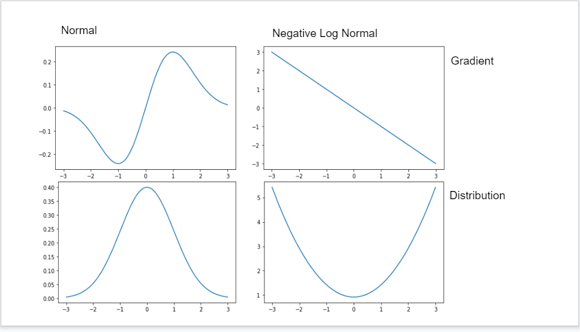

```{r setup, include=FALSE}
knitr::opts_chunk$set(echo = TRUE)
devtools::load_all()
```

# {data-background=#262626}

<h1 style="color: #fff">Metropolis(-Hastings) Algorithm</h1>

<center>
```{r, echo=FALSE}
knitr::include_graphics("files/MH.png")
```
</center>


## Random Walk

> * proposal in MH is sampled randomly from porpoals/jumping distrib $J_t(\theta_a|\theta_b)$

> * the accpetance rule/ transition function ratio of densities guarantees convergence

<div class="fragment">
$$
\begin{aligned}
T_t(\theta^t|\theta^{t-1}) = \frac{\frac{p(\theta^*|y)}{J(\theta^*|\theta^{t-1})}}{\frac{p(\theta^{t-1}|y)}{J(\theta^{t-1}|\theta^*)}}
\end{aligned}
$$
</div>

> * *But* if steps are poorly chosen converges speed, and accordingly, computational effort can get high

<div class="fragment">
$J(\cdot)$ is only useful jumping distibution, if:

* For any $\theta$ it is easy to sample from $J(\theta_a|\theta_b)$

* It is easy to compute r (e.g. if proposal is symmetric)

* The jump has a *reasonable* distance

* We don't reject/ accept jumps to often
 (see @gelman13)
</div>


## Problem

```{r, echo=FALSE, out.width='75%'}
knitr::include_graphics("files/HMC_multimodal.gif")
```
@feng20

* Gibbs and MH spend a lot of time zigging and zagging in the target distribution
* For models in High-D parameter-space reparametrization  and efficient jumping rules might fail

## Idea

> * Introduce a momentum $\phi_j$ for each component $\theta_j$
> * update $\theta\ \& \ \phi$ simultaneously
> * Let the jumping distribution $J(\cdot)$ be largely determined by $\phi$

<div class="fragment">
$\rightarrow$ the resulting algorithm is somewhat a *hybrid* Monte Carlo with a
mix of the known random walk and deterministic simulation methods derived from hamiltonian dynamics
</div>

# {data-background=#262626}

<h1 style="color: #fff">Hamiltonian Monte Carlo</h1>

<center>
```{r, echo=FALSE}
knitr::include_graphics("files/HMC.png")
```
</center>

## HMC in 3 steps:

> 1) update $\phi$, sampled from $\phi \sim \mathcal{N}(0, I)$    
> 2) simultaneously updating of $(\theta,\phi)$ via leapfrog steps    
> 3) acceptance/ rejection step analog to MH-Algorithm    

<div class="fragment">

### Ingredients

* (un-normalized) log posterior density $log(p(\theta|y))$    
</div>

<div class="fragment">
* gradient of $log_e(p(\theta|y))$: 
$\frac{\partial log_e(p(\theta|y))}{\partial \theta}$  
(Note: use analytic solutions here if possible, numerical might make the computational benefit vanish)
</div>

<div class="fragment">
* the momentum distribution $p(\phi)$  
$\rightarrow$ usually $\phi \sim \mathcal{N_d}(0, I)$ where 0 denotes a zero vector of $\mathbb{R^d}$ and I denotes a $\mathbb{R^{dxd}}$ identity matrix
</div>

## Phylical analogy - Why use log?

<center>
```{r, echo=FALSE, out.width='50%'}

```
</center>
@moore

<div class="fragment">
* Suppose HMC moves towards *low posterior density regions*:


$$
sgn\Big(\frac{dlog_e(p(\theta|y))}{d\theta}\Big) = -1 \ \Rightarrow \ \phi\ decreases
$$
</div>

<div class="fragment">

* Suppose HMC moves towards *a local posterior maximum*:

$$
\frac{dlog_e(p(\theta|y))}{d\theta} = 0 \ \Rightarrow \ p(\theta|y)\ slows \ by\ moving\ closer\ to\ local\ max
$$
</div>

<div class="fragment">
$\rightarrow$ HMC works like a mode-finder
</div>

## Phylical analogy

<center>
```{r, echo=FALSE, out.width='75%'}
knitr::include_graphics("files/halfpipe.gif")
```
</center>

## Code - Parameter

```{r, code=readLines("../R/Hamiltonian_MonteCarlo.R")[c(1:9, 42)]}
```


## Code - initilaize Values

```{r, code=readLines("../R/Hamiltonian_MonteCarlo.R")[c(1:14, 42)]}
```

## Code - HMC iteration

```{r, code=readLines("../R/Hamiltonian_MonteCarlo.R")[c(1:21, 40, 42)]}
```

## Code - Leapfrogsteps

```{r, code=readLines("../R/Hamiltonian_MonteCarlo.R")[c(1:30, 40, 42)]}
```

## Code - Accept & Return

```{r, code=readLines("../R/Hamiltonian_MonteCarlo.R")}
```

## {data-background="files/HMC_problem.gif"} 
Problem
@feng20

> * taking too few or too large steps $\rightarrow \ \theta^t\ \& \ \theta^{t+1}$ end up very close. 

## (Hand-)Tuning Parameters

* $\epsilon = stepsize$


* $\mathcal{L} = \#Leapfrogsteps$


* $\phi = momentum$


<div class="fragment">
But how?

<center>
```{r, echo=FALSE, out.width='40%'}
knitr::include_graphics("files/Questioning.gif")
```
</center>
</div>

## Setting the tuning parameters

<div class="fragment">
* *Radius*:
  
  stay in the radius of you target distribution. Rule of thumb: $\epsilon \mathcal{L} = 1$
</div>

<div class="fragment">
* *adaptive updating*: 

  1) run $M_{init}$ steps with initial setting

  2) adjust the parameters based on knowledge from previous run and rerun the model for $M_{adjust}$ steps
</div>

<div class="fragment">
* *Acceptance Sweet Spot*: 65% acceptance rate ($\alpha$)
  
  if $\alpha < 0.65 \Rightarrow$ leapfrog jumps are too ambitious.
  Set $\mathcal{L}\uparrow, \epsilon \downarrow$.
  
  if $\alpha > 0.65 \Rightarrow$ leapfrog jumps are too cautious.
  Set $\mathcal{L}  \downarrow, \epsilon \uparrow$.
(see @gelman13)
</div>

## Desirable behavoir for tuning parameters tuning parameters HMC:

> 1) $\mathcal{L}$ driving the trajectory of steps in one iteration though the whole posterior space.  
*Tackeled by NUTS*

> 2) $\epsilon$ getting smaller in areas of high curvature exploiting various areas.  
*Tackeled by dual averaging*

> 3) $Covar(\phi)$ scaling to the local curvature.  
*Riemanian Integral*

<div class="fragment">
$\rightarrow$ All three approaches may be combined. In the following we will discuss the implementation for a No-U-Turn sampler with dual averaging, as discussed in Gelman and Hoffman (2014).
@hoffman2014
</div>

# {data-background=#262626}

<h1 style="color: #fff" class="r-fit-text">The (naive) No-U-Turn Sampler</h1>

<center>
```{r, echo=FALSE}
knitr::include_graphics("files/nNUTS.png")
```
</center>

<!--
NOTES:
> * As we use the information from Hamiltonian dynamics to tune $\epsilon$ and $\mathcal{L}$ within the run iteration don't guarantee convergence anymore

> * Property of markov chain is not given anymore

<div class="fragment">
* What do we do now?

  + Derive a heuristic when we want to stop the sampling
  + Ensure the adaption satisfies the Markov Chain properties
</div>
-->

## Heuristic Stopping Criteria

</small>
<div class="fragment">

* Lets look at one iteration $t$ in HMC where we intentionally set
  a) $\mathcal{L_t}$ to small
  b) $\mathcal{L_t}$ to high
</div>

<div class="fragment">
* The $\mathcal{L_t}$-Leapfrog steps performed from starting state $(\theta_{right}, r_{right})$ in phase-space to their end  $(\theta_{left}, r_{left})$ after $\mathcal{L_t}$ Leapfrogsteps might look as follows:
</div>

```{r, echo=FALSE}
lable1 <- "Left Plot: Expanding the trajectory in either direction typically extends the trajectory further  across the energy level set (grey) towards unexplored neighborhood. Right Plot: Further expansion typically contracts the boundaries of the trajectory towards each other and neighborhoods that have already been explored."
```

<div class="fragment">
<center>
```{r, echo=FALSE, fig.cap=lable1, out.width="50%"}
knitr::include_graphics("files/U-Turn-Criteria.png")
```
</center>
</div>
</small>

## Criterion

$\rightarrow$ explore the energy level stepwise @betancourt2017

$$
r_{left} (\theta_{right} - \theta_{left}) < 0\\
r_{right} (\theta_{left} - \theta_{right}) < 0
$$

<div class="fragment">
*Derivation:* this is basically a euclidean derivative w.r.t. time t of half the squared distance between two positions: $\frac{d(\theta_1 - \theta_2)}{dt}$.

*Intuition:* this is the dot product of the two vectors from the picture.
If the dot product gets higher than 0, the trajectory will make a *u-turn*.
This is when we "traveled maximally" in phase space an so where we want to stop exploring the enery set.
</div>

## Naive Stepwise Exploration Scheme

> 1) Build a trajectory with a given length
> 2) Check the Termination (No-U-Turn) Criterion
> 3) Expand the trajectory and & Repeat Checks
> 4) Return the sample once the criterion is met

<div class="fragment">
Naive Additive Scheme: Check the termination Criteria for each and every point between any two points
Smart Multiplicative Scheme: Double the trajectory to the old trajectory and so create a balanced binary tree. Compare the criterion only between subtrees.
</div>

## Doubling- expand the trajectory

```{r, echo=FALSE}
lable2 <- "Typical doubling proccedure. The initial point is black. Each colour desricbes a new subtree."
```

<center>
```{r, echo=FALSE, fig.cap=lable2, out.width="75%"}
knitr::include_graphics("files/Doubling.png")
```
@hoffman2014  
</center>

<div class="fragment">
The doubling is halted when the sub-trajectories from the leftmost to the rightmost nodes of any balanced binary tree start to double back on themselves.

*Info:* We have to double fore- and backwards in our trajectory to guarantee reversibility in time
*Problem*: this naive scheme still violates the reversibility criteria
</div>

## Slice to the Rescue

Some of the trajectory points sampled have to be condemn because they exhibit pathological behavior.
To determine those points we introduce a slice variable $u$ to our posterior, such that
$p(u|\theta,r) = Unif(u; [0, e^{\mathcal{L}(\theta) - \frac{1}{2} <r,r>}])$

The joint distribution of $(u, \theta,r)$ is then:   
$p(u, \theta,r) \propto \mathbb{I}[u \in [0, e^{p(\theta, r)}]]$

*Alternative:* draw multinomial over states in the trajectory 

## $\mathcal{B}, \mathcal{C}$ in NUTS

$\mathcal{B}$: constituted by all leaves of the binary tree generated in the doubling proccedure of one NUTS iteration.
If $j$ denotes the depth of a tree the amount of visited states through doubling in leapfrog trajectory is $\#\mathcal{B} = 2^j$.  
$\mathcal{C}$: contains all valid states visited.

```{r, echo=FALSE}
lable3 <- "Example of a trajectory generated during one iteration of NUTS."
```

<center>
```{r, echo=FALSE, fig.cap=lable3, out.width="50%"}
knitr::include_graphics("files/trajectory.png")
```
</center>

## Implement NUTS - Initialize

```{r, warning=FALSE, code=readLines("../R/Showcase_Functions/Simplified_naive_NUTS.R")[c(1:15, 76)]}
```

## Implement NUTS - Itertation

```{r, warning=FALSE, code=readLines("../R/Showcase_Functions/Simplified_naive_NUTS.R")[c(1:31, 74, 76)]}
```

## Implement NUTS - Doubling the tree

```{r, warning=FALSE, code=readLines("../R/Showcase_Functions/Simplified_naive_NUTS.R")[c(1:63, 74, 76)]}
```

## Implement NUTS - Sample a state

```{r, warning=FALSE, code=readLines("../R/Showcase_Functions/Simplified_naive_NUTS.R")}
```

## Implement Build Trees - Initialize

```{r, warning=FALSE, code=readLines("../R/Showcase_Functions/Simplified_Build_Tree.R")[c(1:20, 68)]}
```

## Implement Build Trees - Base Case

```{r, warning=FALSE, code=readLines("../R/Showcase_Functions/Simplified_Build_Tree.R")[c(1:28, 51, 68)]}
```

## Implement Build Leaf

```{r, warning=FALSE, code=readLines("../R/Showcase_Functions/Simplified_Build_Tree.R")[70:104]}
```

## Implement Build Trees - Doubled Recurion

```{r, warning=FALSE, code=readLines("../R/Showcase_Functions/Simplified_Build_Tree.R")[c(1:51, 67, 68)]}
```

## Implement Build Trees - Update State

```{r, warning=FALSE, code=readLines("../R/Showcase_Functions/Simplified_Build_Tree.R")[c(1:68)]}
```


# {data-background=#262626}

<h1 style="color: #fff" class="r-fit-text">No-U-Turn Sampler with dual averaging</h1>

<center>
```{r, echo=FALSE}
knitr::include_graphics("files/NUTS.png")
```
</center>

## Problems & Solutions

Naive NUTS requires: 

> * $2^{j}-1$ evaluations of log-posterior $log(p(\theta))$ and its gradient $\Delta_{\theta}log(p(\theta))$

> * $\mathcal{O}(2^j)$ evaluations when to stop doubling

> * store $2^j$ position and momentum vectors at each iteration

<div class="fragment">
Idea:

* Implement a transition kernel that produces larger jumps than uniform sampling while keeping $\mathcal{C}$ balanced.

</div>

## Efficient NUTS

For each subtree $\mathcal{B_{st}}$ in $\mathcal{B}$:

> * sample a valid state $(\theta, r) \in \mathcal{C_{st}}$ as representee

> * choose a pair by giving them a weight proportional to their subtrees element size

<div class="fragment">
* $\rightarrow$ this method stores only $\mathcal{O}(j)$ position momentum vectors and

* is sparse at calculating the gradient as build tree can be canceled early if U-turn was made
</div>

## Adaptively tuning the stepsize

<div class="fragment">
*Suppose* we aim for a target average acceptance probability $\delta (= 0.65)$.

*Suppose* our average acceptance at iteration t is $\alpha_t$

Let $H_t = \delta - \alpha_t$ then be our MCMC behavior at iteration t

*Goal:* reach $H_t \approx 0$
</div>

<div class="fragment">
*Update* $\epsilon$ as follows:

$\epsilon_{t+1} =\epsilon_t - \eta_tH_t, \ \eta_t \in (0,1]$
</div>
<div class="fragment">
If acceptance $\alpha_t$ was to high we encourage the algorithm for larger jumps, rising $\epsilon_{t+1}$
If acceptance $\alpha_t$ was to low we encourage the algorithm for smaller jumps, decreasing $\epsilon_{t+1}$
</div>

## Implement efficient NUTS with dual averaging

```{r, warning=FALSE, code=readLines("../R/Showcase_Functions/Simplified_Build_Tree.R")[c(1:68)]}
```

<!--
Why -1 one here?
-->

# {data-background="files/stan.png" data-background-size="800px 600px"}

## Presettings

**Loading the package** 

```{r, eval=FALSE}
library("rstan")
```

**To estimate your model in parallel**

```{r, eval=FALSE}
options(mc.cores = parallel::detectCores())
```

Automatically save a bare version of a compiled Stan program to the hard disk so that it does not need to be recompiled

```{r, eval=FALSE}
rstan_options(auto_write = TRUE)
```

You will need to run these commands each time you load the rstan library.

## Example Eight Schools - SetUp

This is an example in Section 5.5 of @gelman13, which studied coaching effects from eight schools.

We start by writing a Stan program for the model in a text file.
If you are using RStudio click on `File -> New File -> Stan File` . 
Either way, paste in the following and save your work to a file called `schools.stan` in R's working directory.

```{stan, output.var='priors', eval = FALSE, tidy = FALSE}
// saved as schools.stan
data {
  int<lower=0> J;         // number of schools 
  real y[J];              // estimated treatment effects
  real<lower=0> sigma[J]; // standard error of effect estimates 
}
parameters {
  real mu;                // population treatment effect
  real<lower=0> tau;      // standard deviation in treatment effects
  vector[J] eta;          // unscaled deviation from mu by school
}
transformed parameters {
  vector[J] theta = mu + tau * eta;        // school treatment effects
}
model {
  target += normal_lpdf(eta | 0, 1);       // prior log-density
  target += normal_lpdf(y | theta, sigma); // log-likelihood
}

```

In this Stan program, we let `theta` be a transformation of `mu`, `eta`, and `tau`
instead of declaring `theta` in the `parameters` block, which allows the sampler will run more efficiently ([see detailed explanation](http://mc-stan.org/documentation/case-studies/divergences_and_bias.html)).
We can prepare the data (which typically is a named list) in R with: 

## Example Eight Schools - Run

```{r, eval=FALSE}
schools_dat <- list(J = 8, 
                    y = c(28,  8, -3,  7, -1,  1, 18, 12),
                    sigma = c(15, 10, 16, 11,  9, 11, 10, 18))
```

And we can get a fit with the following R command. Note that the argument to `file = ` should point to where the file is on your file system unless you have put it in the working directory of R in which case the below will work. 

```{r, eval=FALSE}
fit <- stan(file = 'schools.stan', data = schools_dat)
```

```{r eval=FALSE, echo=FALSE}
saveRDS(fit, file = "files/fit.RDS")
saveRDS(fit2, file= "files/fit2.RDS")
```


```{r, echo=FALSE}
fit <- readRDS(file = "files/fit.RDS")
fit2 <- readRDS(file= "files/fit2.RDS")
```

The object `fit`, returned from function `stan` is an [S4 object](https://cran.r-project.org/package=rstan/vignettes/stanfit-objects.html) of class
`stanfit`. 

## Example Eight Schools - Evaluate

Methods such as `print`, `plot`, and `pairs` are associated with the
fitted result so we can use the following code to check out the results in `fit`. 
`print` provides a summary for the parameter of the model as well
as the log-posterior with name `lp__` (see the following example output).
For more methods and details of class `stanfit`, see the help of class `stanfit`. 
We can use the `extract` function on `stanfit` objects to 
obtain the samples. 

```{r, eval=FALSE}
print(fit)
plot(fit)

la <- extract(fit, permuted = TRUE) # return a list of arrays 
mu <- la$mu 

### return an array of three dimensions: iterations, chains, parameters 
a <- extract(fit, permuted = FALSE) 

### use S3 functions on stanfit objects
a2 <- as.array(fit)
m <- as.matrix(fit)
d <- as.data.frame(fit)
```

## Example Eight Schools - Plot Distributions

```{r}
pairs(fit, pars = c("mu", "tau", "lp__"))
```


# References
