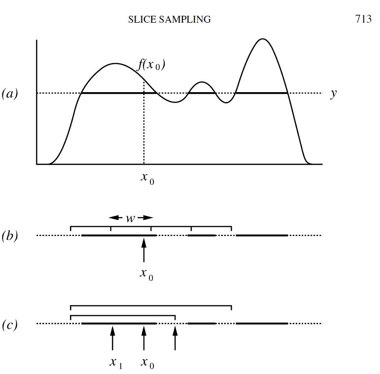

## Slice Sampling


<br>
<div class="fragment">
**Idea**: Sample from a distribution by sampling uniformly from the region under the plot of its density function.
</div>
<br> 
<div class="fragment">
**MC-convergence**: constructed by alternating uniform sampling from vertical direction and horizontal slice.
</div>
<br>
<div class="fragment">
**Methods:** various methods and implementations of slice sampling are available from easy methods as univariate slice sampling to rather complex methods as elliptic slice sampling
</div>

## Slice Sampling - Univariate Steps

<br>

> 1. Choose a random starting value of x, $x_1$

<br>

> 2. Uniformly sample on $u \sim U([0, f(x_t)])$

<br>

> 3. Imagine a horizontal line at y = u. Figure out all the line segments under the curve.

<br>

> 4. From all the line segments, draw a value of x

<br>

> 5. Repeat step 2 -4

<br>

@chan

## Slice Sampling - Univariate Graphic

<center>
```{r, echo=FALSE, out.width="65%"}

```
</center>
<small>
@neal
</small> 

## Slice Sampling - Limitations

<br>

> * Probably slower than Metropolis Hastings.

<br>

> * Finding the roots of the intersection between horizontal line and distribution can be tricky.

<br>

> * Sample from Multivariate Distribution by Slice Sampling in the manner of Gibbs Sampling  suffer from complication introduced by dimensionality


## Slice Sampling - Benefits 

<br>

> * very easy implementation Implementation

<br>

> * can supress random walk behavior

<br>

> * more efficient than Metropolis as slice sampling auto-adjusts the step size for you

<br>

> * no proposal distribution required

<br>

> * no rejections

<br>

<div class="fragment">
$\Rightarrow$ good for routine and automated use. See implementation in NUTS...
</div>
<div class="fragment">
$\Rightarrow$ Great choice when there is little knowledge about the distribution we are sampling from
<br>
@xing
</div>

# References
